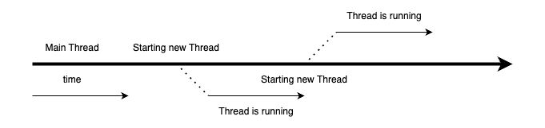

= 1. Process vs Thread

{empty} +

== 1-1. Process(프로세스)

* 실행 중인 프로그램을 의미한다.
* 스케줄링의 대상이 되는 작업(task)과 같은 의미로 쓰인다.
* Storage의 프로그램을 실행하면, 실행을 위해서 메모리 할당이 이루어지고 할당된 메모리 공간으로 바이너리 코드가 올라간다.
** 이 순간부터 process라고 불린다.
* process는 하나 이상의 스레드 구성이 된다.

{empty} +

== 1-2. Thread(스레드)

* process와 유사하지만, 메모리의 많은 부분을 공유한다.
* Thread별로 Stack과 Register를 가지고 있음
* Thread of Control을 줄인 말로, 제어의 흐름을 시각적으로 표현

{empty} +

link:exam/exam-01-01.adoc[Exam-01. Linux 명령어를 이용해 시스템에서 동작 중인 process와 thread에 알아보자.]

{empty} +

== 1-3. Process와 Thread의 차이

[frame=ends, cols="1,1"]
|===
^s| Process
^s| Thread

|프로그램이 실행하기 위한 모든 자원들을 개별적으로 가지고 있어 무겁다
|개별적으로 분리가 필요한 최소한의 자원들만 가져 LWP(Light Weight Process)라고도 하는 경량 process

|process별로 자체 메모리를 갖는다
|process내의 다른 thread와 메모리를 공유한다.

|
개별 메모리로 인해 process 간 통신이 느리다.

process간 통신을 위해서는 OS에서 제공하는 다양한 통신 기술을 이용해야 한다.
|공유 메모리를 이용한 직접 통신이 가능해 thread 간 통신이 빠르다.

|Multi process 지원 시스템에서는 process context switchingfootnote:[https://www.geeksforgeeks.org/context-switch-in-operating-system/[Context switch in operating system]]시 이전 process의 메모리 및 스택 정보를 storage에 저장하는 swappingfootnote:[https://www.geeksforgeeks.org/swapping-in-operating-system[Swapping in operating system]]이 발생할 수 있으며, 이는 메모리에 있던 정보르 storage에 옮기거나 storage에 저장된 정보를 메모리에 올리는 작업이 수행되므로 비용이 많이 든다
|thread 간 context 전환은 공유 메모리로 인해 비용이 저렴하다.

|
구성 요소에 대한 여러 process가 있는 application은 메모리가 부족할 때 더 나은 메모리 활용도를 제공할 수 있다.

Application의 비활성 process에 낮은 우선순위를 할당할 수 있다. 그러면 이 유휴 process는 storage로 swappingfootnote:[https://www.baeldung.com/linux/find-swap-memory-usage-by-processes[Find Swap Memory Usage by Processes in Linux]]될  수 있다.
|메모리가 부족한 경우 Multi-threaded application은 메모리 관리를 위한 어떠한 조항도 제공하지 않는다.
|===

{empty} +

== 1-4. Single Thread

* Main 스레드에서 작업 진행, 작업은 순차적으로 진행됨

* 하나의 프로세스에서 오직 하나의 스레드로만 실행
** 단일 레지스터와 스택으로 구성
** Context Switching 작업을 요구하지 않음
** 동시성 제어에 대한 처리를 신경 쓰지 않아도 됨

{empty} +

== 1-5. Multi Thread

* 프로그램 내에서 두 개 이상의 동작을 동시에 실행
** 프로세서의 활동을 극대화
** 두 개가 동작을 동시에 실행
* 하나의 프로세스를 다수의 실행 단위로 구분하여 자원을 공유
** 자원의 생성과 관리의 중복성 최소화
** 수행 능력 향상

*참고*

* link:https://www.baeldung.com/cs/process-vs-thread[Baeldung: Process vs Thread]
* link:https://www.geeksforgeeks.org/difference-between-process-and-thread/[GeeksforGeeks: Difference between process and thread]

---

ifndef::env-github[]
link:../index.adoc[돌아가기]
endif::[]

ifdef::env-github[]
link:../README.md[돌아가기]
endif::[]
