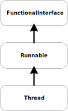

= 2. Thread Class를 이용한 thread 구현

**여기서는**

* Thread class를 확장해 thread로 동작하는 클래스를 만든다.
* Thread class 확장을 통해 여러 작업을 동시해 실행해 확인한다.
* Single thread 환경에서의 여러 작업을 실행하여 문제점을 확인한다.

{empty} +

== 2-1. Thread class

Java에서 thread 지원을 위해 제공되는 class로서 이를 이용한 새로운 thread class 구현이 가능하다.

Thread class는아래와 같은 확장 또는 구현 관계를 갖는다.

[.text-center]
.Thread class hirerachy

{empty} +

== 2-2. Counter class vs ThreadCounter class

간단하게 Counter class를 만들어 보자.

link:quiz/quiz-02-01.adoc[Quiz-01. 1초마다 횟수를 1씩 증가하는 Counter class로 정의하고, 실행 후 결과를 확인하라]

{empty} +

위에서 정의한 Counter class를 Thread class를 이용해 thread로 동작하도록 수정해 보자.

link:quiz/quiz-02-02.adoc[Quiz-02. Thread class를 이용해 1초마타 횟수를 1씩 증가하는 ThreadCounter class를 정의하고, 실행 후 결과를 확인하라]

{empty} +

* Counter class와 ThreadCounter class의 기능적 차이가 있는가?

* Counter class와 ThreadCounter class의 instance를 실행했을때 어떠한 차이가 있는가?

* 각각의 instance가 실행 중일때, 디버거를 이용해 call stack을 비교해 보고 차이점을 이야기해 보자.

{empty} +

== 2-3. 다중 instance의 생성

여러개의 instance를 만들어서 동시에 실행 시켜 보자.

link:quiz/quiz-02-03.adoc[Quiz-03. Counter class의 instance를 2개 이상 만들고 실행 후 동작에 대해 설명해보자]

link:quiz/quiz-02-04.adoc[Quiz-04. ThreadCounter class의 instance를 2개 이상 만들고 실행 후 동작에 대해 설명해보자]

* 두가지 경우를 비교해 thread의 동작에 대해 설명해 보자.

---

ifndef::env-github[]

link:../index.adoc[돌아가기]

endif::[]

ifdef::env-github[]

[돌아가기](../README.md)

endif::[]