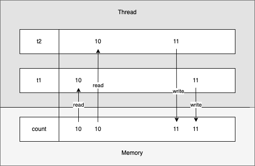
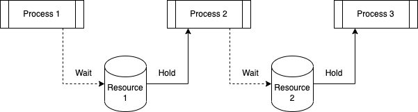

= 6. Thread 동시성 제어

Thread는 하나의 process내에서 자원을 공유하면서 여러 개가 동시에 실행될 수 있다.

이에 따른 문제점과 해결 방법에 대해 알아 본다.

{empty} +

== 6-1. Thread 동기화 문제

Thread 동기화 문제가 발생할 수 있는 것들을 개념적으로 살펴보자.

{empty} +

=== 6-1-1. Race Condition(경쟁 조건)

Race condition은 둘이상의 thread가 동시에 공유 자원 접근 시 발생한다.

첫 번째 thread가 변수를 읽고 두 번째 thread도 변수에서 동일한 값을 읽는다.

그런 다음 첫 번째 thread와 두 번째 thread는 값에 대한 작업을 수행하고 변수에 마지막으로 값을 쓰기 위해 두 thread는 경쟁하게 되고 하나의 thread가 값을 쓰고, 다음 thread가 값을 덮어쓴다면 마지막에 쓴 thread의 값이 저장되어 원하는 결과를 얻지 못하게 될 것이다.

다음의 예제를 통해 확인해 보자.

link:exam/exam-06-01.adoc[Exam-6-1. 공유 count를 갖는 SharedCounter class를 만들어 race condition 문제에 대해 확인해 보자]

결과는 20000이 나와야 하지만 실행할 때마다 다른 결과를 보인다.

이는 counter1이 count를 읽어 1을 추가한 후 count에 업데이트하기 전에, counter2가 count를 읽어 1을 추가하여 count는 11이 되었지만,  counter1이 수행할 결과를 덮어 버림으로써 counter2가 수정한 결과를 잃어버리는 문제가 발생한다.

이처럼 하나 이상의 thread가 경쟁하는 문제를 race condition이라고 하고, 동시 접근을 함으로써 문제가 발생할 수 있는 구역을 Critical Section(임계구역)이라 한다.

{empty} +

=== 6-1-2. Critical Section(임계 구역)

병렬 컴퓨팅에서 두 이상의 process 또는 thread가 동시 접근이 허용되지 않는 공유 자원(자료 구조 또는 장치)에 접근하는 코드의 블록을 말한다. Critical section은 thread에서 작업에 필요한 최소한의 시간 동안만 유지되어야 하고, 작업이 완료된 후에는 반드시 해제되어야 한다. 따라서 한 thread가 critical section에 들어가고 작업이 진행 중이라면, 나머지 thread들은 해당 작업이 완료될 때까지 대기해야 한다. thread가 공유 자원의 Mutual Exclusion(상호 배제)를 보장받기 위해서 critical section에 들어가거나 나올 때를 위한 다양한 동시성 제어 메커니즘이 제공됩니다.

{empty} +

=== 6-1-3. Mutual Exclusion(상호 배제)

Mutual exclusion이란 두 개 이상의 process 혹은 thread가 동시에 하나의 공유 자원으로 발생할 수 있는 race condition 문제를 해결하기 위해 어느 시점에서의 공유 자원 접근을 하나의 process 혹은 thread로 제한하는 것을 말한다.

{empty} +

=== 6-1-4. Deadlock(교착 상태)

Deadlock은 mutual exclusion 과정에서 자원 접근 권한 획득과 자원 접근 권한 반환 관계의 꼬임으로 발생한다.

다음은 교착 상태가 발생할 수 있는 몇 가지 조건을 나타낸다

{empty} +

==== 6-1-4-1. Hold and Wait(점유 대기)

점유 대기 상태는 아래 그림과 같이 process 2와 같이 resource 1의 접근 권한을 획득한 상태에서 resource 2의 접근 권한을 기다리고 있는 것을 말한다.

process 2의 수행 과정이 resource 2의 접근 권한을 획득하여 처리한 후 resource 1의 접근 권한을 해제한다면 process 3이 접근 권한을 해제하기 전까지는 무한 대기 상태에 놓이게 된다.

아울러 resource 1의 접근 권한을 요청하고 있는 process 1도 무한 대기 상태가 된다.

{empty} +

==== 6-1-4-2. Circular Wait(순환 대기)

순환 대기는 점유 대기와 공유 자원 획득 후 다른 공유 자원 획득 시까지 무한 대기 상태는 동일하지만, 대기 관계가 아래 그림과 같이 순환 구조를 이루고 있다.

process 1은 resource 2에 대한 접근 권한을 가진 상태에서 resource 1에 대한 접근 권한을 기다리고, process 2는 resource 1에 대한 접근 권한을 가진 상태에서 resource 2에 대한 접근 권한을 기다린다.

두 개의  process는 서로가 다른 process가 가지고 있는 접근 권한을 얻기 위해 대기하고 있어, 하나의 process가 먼저 해제하지 않는 이상 대기 상태는 계속해서 유지된다.

image::image/circular_wait.svg[title="Circular Wait", align="center"]

{empty} +

==== 6-1-4-3. Starvation(기아 상태)

기아 상태는 다른 process나 thread가 공유 자원의 접근 권한을 지속적으로 가짐으로써 발생할 수 있다. process나 thread가 공유 자원의 접근 권한을 해제하더라도 운영 방식등의 이유로 인해 해당 process나 thread가 공유 자원의 접근 권한을 획득하지 못하는 경우도 동일하다.

process나 thread의 우선순위가 다를 경우, 우선순위가 낮은 process나 thread는 scheduler에 의해 공유 자원에 대한 접근 권한을 획득할 만큼의 수행 시간을 갖지 못해 무한히 대기 상태에 놓일 수 있다.

{empty} +

=== 6-1-5. Livelock

Livelock은 deadlock 문제를 해결하기 위해 공유 자원 접근 요청 후 일정 시간 안에 권한 획득에 실패한 경우, 수행 과정을 종료하면서 발생할 수 있다.

두 개의 process나 thread에서 교착 상태를 유지하다 일정 시간 후 자원 접근 요청을 철회할 때, 두 개의 process나 thread가 동시에 수행하여 자신이 확보하고 있던 공유 자원 접근 권한을 반환하여 교착 상태가 해결된다. 하지만, 두 개의 process나 thread는 교착 상태와 같이 아무런 작업을 수행하지 못하는 것은 아니지만, 해당 자원에 대한 접근 권한을 확보하지 못해 관련된 작업을 수행하지 못하는 결과를 가져온다.

교착 상태는 관련된 process나 thread가 대기 상태를 계속 유지함으로써 여타의 작업 수행이 불가능하지만 livelock은 해당 자원에 대한 작업만 처리하지 못할 뿐 나머지 작업은 처리되는 차이를 가지고 있다.

link:https://www.baeldung.com/java-deadlock-livelock[Java Thread Deadlock and Livelock]
{empty} +

== 6-2. Synchronized

Java에서는 thread 동기화를 위해 synchronizedfootnote:[https://www.baeldung.com/java-synchronized[Guide to the Synchronized keyword in java]] keyword를 다양한 곳에 적용할 수 있다.

* Instance methods
* Static methods
* Code blocks

{empty} +

=== 6-2-1. Instance method 동기화

synchronized를 이용한 instance method 동기화 방법은 아래와 같이 method의 접근 제한자에 키워드 추가만으로 가능하다.

[source,java]
----
public synchronized void increment() {...}
----

link:exam/exam-06-02.adoc[Exam-6-2. Exam-6-1에서 발생했던 race condition 문제를 syncrhronized keyword를 이용해 해결해 보자]

=== 6-2-2. Static method 동기화

위에서는 instance method에 대해 synchronized를 적용해 보았다. 여기서는 instance object와 상관없이 적용될 수 있음을 확인해 보도록 한다.

link:exam/exam-06-03.adoc[Exam-6-3. Exam-6-1에서 발생했던 race condition 문제를 static instance를 생성하고, syncrhronized keyword를 이용해 해결해 보자]

Exam-6-2와 Exam-6-3의 근본적인 동작은 동일하지만, Exam-6-2는 동적으로 생성된 instance variable에 적용하고, Exam-6-3는 class loading 시점에 생성되는 static variable에 적용한 것이 다르다.

{empty} +

=== 6-2-3. Code block 동기화

그렇다면, 동기화를 위해서는 반드시 해당 object의 class에서 적용되어야 하는가?

그렇지는 않다. synchronized는 method 뿐만 아니라 별도의 code block에도 적용 가능하다.
다만, code block 생성시 lock을 설정할 object는 필요하다.

link:exam/exam-06-04.adoc[Exam-6-4. Exam-6-1에서 발생했던 race condition 문제를 SharedCount object와 synchronized code block을 이용해 해결해 보자]

{empty} +

== 6-3. Synchronization Control

Java에서는 synchronized method 또는 block에서의 제어를 위해 wait()와 notify()를 지원한다.

wait()는 syncrhonized 영역에서 lock을 소유한 thread가 어떠한 이유에서 자신의 제어권을 양보하고 WAITING 또는 TIMED_WAITING 상태에서 대기하기 위해서 사용된다.

notify()와 notifyAll()은 syncrhonized 영역에서 WAITING 상태에 있는 다른 thread를 다시 RUNNABLE 상태로 변경시키는 역할을 한다.

한 가지 착각하기 쉽지만, wait, notify, notifyAll은 Thread의 static method가 아닌 instance method라는 점이다.

image::image/wait_and_notify.svg[title="Wait and Notify", align=center]

{empty} +

=== 6-3-1. wait()

wait()는 synchronized 영역 내에서 소유하고 있는 lock을 양보하고, WAITING 또는 TIMED_WAITING 상태로 전환되어 notify가 올때 까지 timeout이 될때까지 기다리도록 사용된다. 이는 다른 스레드에서 notify()나 notifyAll()을 호출함으로써 WAITING 또는 TIMED_WAITING 상태의 스레드가 RNNNABLE 상태로 변경된다.

스레드에서 wait()를 호출하기 위해서는 lock을 소유한 상태이어야 하고, wait() 호출은 자신이 가지고 있던 lock 권한을 풀어버림으로써 다른 스레드가 임계 구역에 진입할 수 있도록 한다.

wait()에 의해 lock 권한을 잃어버리고, WAITING 또는 TIMED_WAITING 상태가 된 스레드는 다른 스레드에서 notify() 또는 notifyAll()을 호출하기 전까지는 대기 상태를 유지한다.

{empty} +

=== 6-3-2. notify()

notify()  함수는 wait() 함수와 마찬가지로 lock을 소유한 상태에서 호출할 수 있다. notify() 함수가 호출되면, wait() 함수를 이용해 대기 상태에 있던 스레드 중 임의의 하나가 깨어난다. 깨어난 스레드는 WAITING 또는 TIMED_WAITING 상태에서 RUNNABLE 상태로 변경되어 실행할 수 있는 상태가 된다.

예제를 통해 wait()와 notify()에 대해 알아보자.
예제는 Data class를 이용해 문자열을 주고 받는다.

link:exam/exam-06-05.adoc[Exam-6-5. Baeldung: wait and notify() method in java]

{empty} +

=== 중요 사항

* Thread가 synchronized method 또는 block에 들어가면 잠금을 획득하고 작업을 완료하고 synchronized method를 종료하면 잠금을 해제한다.
* Thread가 synchronized instance method 또는 block에 들어가면 object 수준 잠금을 획득하고 synchronized static method 또는 block에 들어가면 class 수준 잠금을 획득한다.
* Java synchronization은 sychronized block에 사용된 object가 null인 경우 null point exception를 발생시킵니다.
* Java에서 wait(), notify() 및 notifyAll()은 syncrhonization에 사용되는 중요한 방법이다.
* 변수에는 java synchronized keyword를 적용할 수 없다.
* final이 아닌 field에 대한 참조는 언제든지 변경될 수 있으며 다른 object에서 서로 다른 thread가 synchronization될 수 있으므로 synchronized block의 final이 아닌 field에서 동기화하지 말라.

{empty} +

=== 이점

* Multi-thread
** java는 multi-thread 언어이므로, 동기화는 공유 resource에서 상호 배제를 달성하는 좋은 방법이다.
* Instance method 및 static method
** synchronized instance method와 synchronized static method는 서로 다른 object를 잠그는 데 사용되므로 동시에 실행할 수 있다.

{empty} +

=== 제한 사항

* 동시성 제한
** Java 동기화는 동시 읽기를 허용하지 않는다.
* 효율성 감소
** Java에서 synchronized method는 매우 느리게 실행되며 성능이 저하될 수 있으므로 꼭 필요한 경우에만 동기화하고 코드의 중요한 섹션에 대해서만 블록을 동기화해야 한다.

{empty} +

== Semaphore

link:https://www.baeldung.com/java-semaphore[Semaphores in Java]

{empty} +

== Mutex

link:https://www.baeldung.com/java-mutex[Using a Mutex Object in Java]

ifndef::env-github[]
link:../index.adoc[돌아가기]
endif::[]

ifdef::env-github[]
link:../README.md[돌아가기]
endif::[]