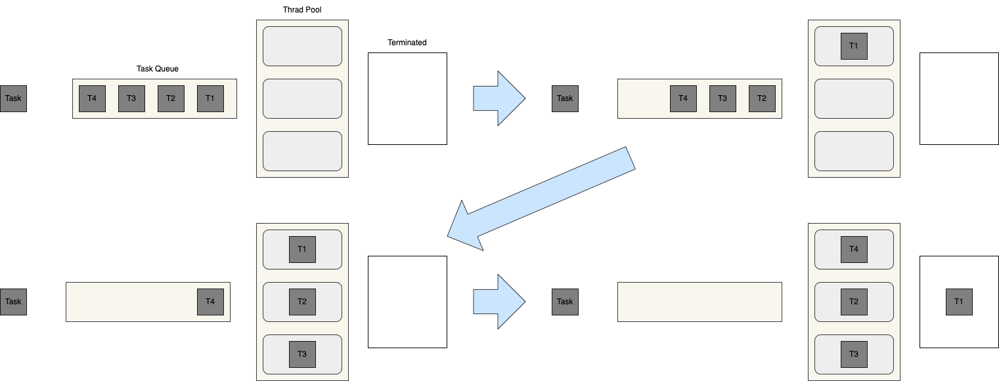

= 8. Thread Pool

{empty} +

Java thread pool은 여러 개의 thread를 만들어 두고 만들어 여러 번 재사용되는 작업자 thread 그룹을 나타낸다.

Thread pool은 고정 크기로 생성된 thread pool에 Runnable object를 주고 실행을 요청하면, thread pool에서 thread를 가져와 실행시킨다.

만약 thread pool에 남아 있는 thread가 없다면, 유휴 thread가 생길 때까지 해당 작업은 실행되지 못하고 대기상태에 있게 된다.

실행 중이던 thread는 작업이 완료되면 다시 thread pool로 돌아오게 되고, 대기 중인 작업이 있는 경우 다시 실행하게 된다.

{empty} +

간단한 예제를 살펴 보자.

link:exam/exam-08-01.adoc[exam-8-1. 10개의 thread가 시작 메시지를 출력하고, 2초간 대기 후 종료 메시지를 출력하도록 thread pool을 구성해보자.]

link:exam/exam-08-02.adoc[exam-8-2. Thread pool를 이용해 한정된 자원에서 많은 작업을 등록하여 수행하도록 구성해 보자]

{empty} +

== 8-1. Thread Pool의 장점

* Thread 생성과 삭제에 따른 시간과 resource를 절약할 수 있다.

{empty} +

== 8-2. Thread Pool 사용 시 주의할 점

**Deadlock**

* Multi-thread와 관련된 모든 프로그램에서 교착 상태가 발생할 수 있다.
* 작업 간 데이터 교환이 필요한 경우, 실행 작업과 대기 작업의 교착 상태가 발생할 수 있다.

**Thread Leakage**

* 비정상 종료에 의한 실행 종료

**Resource Thrashing**

* 지나치게 큰 thread pool을 사용할 경우, thread 간 context 전환 시 느려지는 문제가 발생할 수 있다.

{empty} +

=== 8-2-1. Thread Group

* Java는 단일 object에서 여러 thread를 그룹화하는 편리한 방법을 제공한다.
* 단일 함수 호출로 thread group을 pause, resume 또는 stop할 수 있다.
* pause, resume, stop 등의 안전성의 이유로 사용하지 말것을 권장함으로 ThreadGroup 역시 사용하지 않는 것이 좋다.

link:exam/exam-08-03.adoc[exam-8-3. 2개의 thread로 thread group을 만들고, 일괄 제어해 보자.]
{empty} +

---

ifndef::env-github[]
link:../index.adoc[돌아가기]
endif::[]

ifdef::env-github[]
link:../README.md[돌아가기]
endif::[]