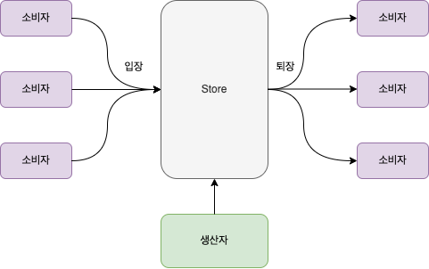

= 10. 연습 문제: 생산자-소비자 솔루션

Thread를 이용해 생산자와 소비자가 거래하는 생산자-소비자 솔루션을 구성해 본다.

{empty} +

== Exam-10-01. 마트내에 위치한 매장(Store)을 정의하라.
* 매장은 물건을 납품 받아서 판매한다.
* 매장에는 최대 10개의 물건만 전시할 수 있다.
* 매장은 최대 5명까지만 동시 입장 가능하다.
* 매장에서 물건 구매는 동시에 1명만 가능하다.
* 매장에서 물건 판매 후 빈 공간에 생기면 생산자에게 알려 준다.
* 매장에서 물건 납품은 동시에 1명만 가능하다.
* 매장에서 물건이 들어오면 소비자에게 알려 준다.

[source,java]
----
public class Store {
		...

    public Store() {
				...
    }

    public void enter() {
				...

    }

    public void exit() {
				...
    }

    public synchronized void buy() {
				...
    }

    public synchronized void sell() {
				...
    }
}
----

{empty} +

== Exam-10-02. 매장에 물건을 납품하는 생산자(Producer)을 정의하라.
* 생산자는 매장에 물건이 부족하지 않도록 채워둔다.
* 물건은 1~10초 간격으로 채운다.
* Thread내에서 난수 생성을 위해서는 ThreadLocalRandom.current().nextInt()를 사용하면 된다.

[source,java]
----
import java.util.concurrent.ThreadLocalRandom;

public class Producer implements Runnable {
    ...

    public Producer(Store store) {
        ...
    }

    @Override
    public void run() {
				...
    }
}
----

{empty} +

== Exam-10-03. 매장에 물건을 구매하는 소비자(Consumer)을 정의하라.
* 소비자는 매장에 입장 후 물건을 구매할 수 있다.
* 매장에는 입장 인원 제한이 있으므로, 인원 초과시 기다린다.
* 매장에 입장하면 물건을 구매하고, 퇴장한다.
* 1~10초 간격으로 구매한다.

[source,java]
----
import java.util.concurrent.ThreadLocalRandom;

public class Consumer implements Runnable {
    Store store;
    ...

    public Consumer(String name, Store store) {
        ...
    }

    @Override
    public void run() {
				...
    }
}
----

ifndef::env-github[]
link:../index.adoc[돌아가기]
endif::[]

ifdef::env-github[]
link:../README.md[돌아가기]
endif::[]